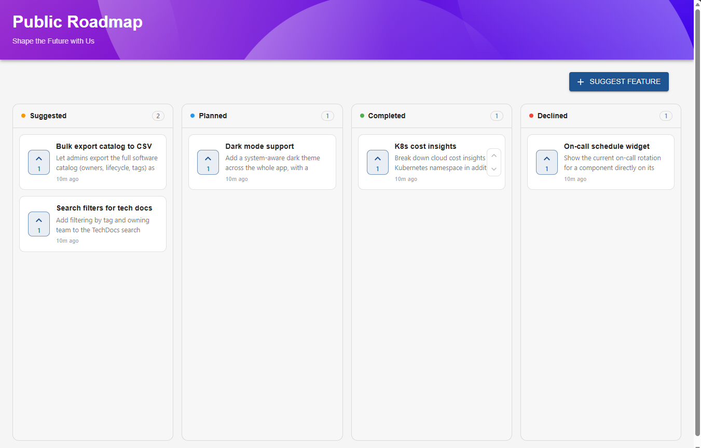
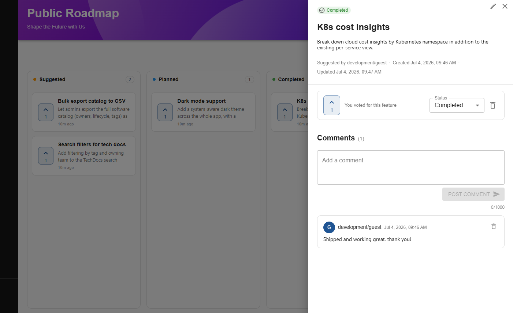
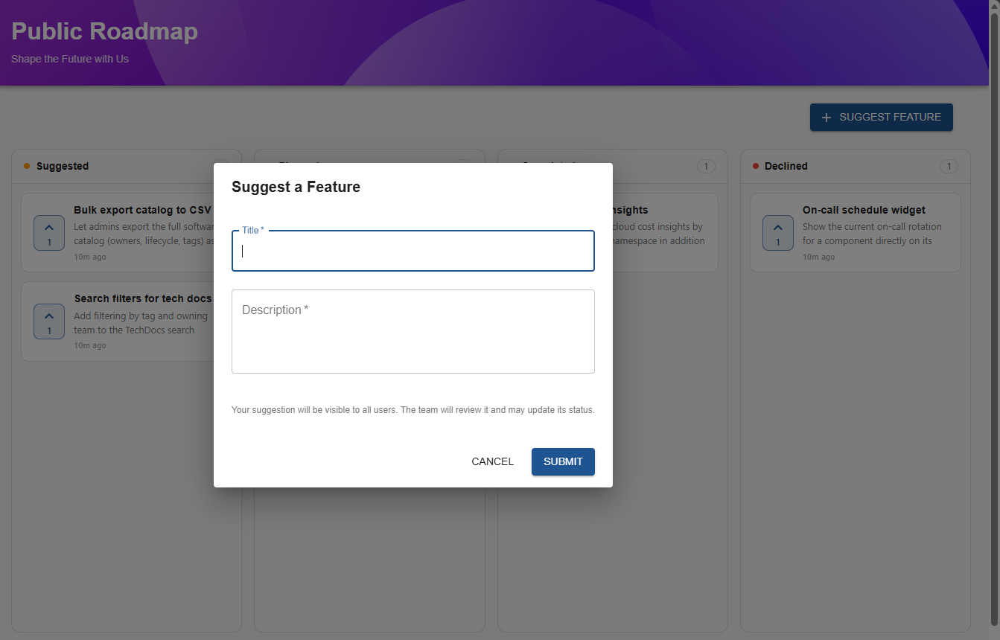

# 🗺️ Backstage Roadmap Plugin

[](https://www.npmjs.com/package/@rothenbergt/backstage-plugin-roadmap)
[](https://www.npmjs.com/package/@rothenbergt/backstage-plugin-roadmap-backend)
[](https://github.com/rothenbergt/backstage-roadmap-plugin/actions/workflows/ci.yml)
[](https://opensource.org/licenses/Apache-2.0)
[](https://backstage.io)
[](https://nodejs.org)

## 🌟 Overview

The Backstage Roadmap Plugin takes roadmaps out of hidden places like Confluence and puts them front and center. Teams can share what’s coming up, while users get to chime in by suggesting features, voting on ideas, and adding comments. It’s all about creating a space where feedback flows easily, and everyone helps shape the future of the platform together.

🚀 **Note:** This plugin uses the new Backstage [frontend system](https://backstage.io/docs/frontend-system/) and the new [backend system](https://backstage.io/docs/backend-system/).

## 📸 Screenshots

### Main Dashboard



### Feature Details



### Suggest New Feature



## ✨ Features

- 📊 Visual roadmap board
- 🗳️ Voting system
- 💬 Comment section for each feature
- 🔐 Role-based permissions (admin vs. regular user)
- 🆕 Feature suggestion form for users
- 🦊 (Optional) GitLab integration — use GitLab issues as the datasource

## 🛠️ Installation

1. Install the plugin in your Backstage instance:

   ```
   yarn add @rothenbergt/backstage-plugin-roadmap-backend --cwd packages/backend
   yarn add @rothenbergt/backstage-plugin-roadmap --cwd packages/app
   ```

2. Add the plugin to your `packages/backend/src/index.ts`:

   ```typescript
   // ...
   backend.add(import('@rothenbergt/backstage-plugin-roadmap-backend'));
   ```

3. The frontend plugin uses the new Backstage frontend system and is automatically discovered. No additional wiring is needed in your app.

## 🖥️ Usage

After installation, navigate to the `/roadmap` route in your Backstage instance. From there, you can:

- View the current roadmap
- Vote on features
- Suggest new features
- Comment on existing features
- (Admins) Manage feature statuses

## ⚙️ Configuration

If you aren't utilizing the Backstage permission framework, add the following to your `app-config.yaml` to enable the Admin Functions for specific users:

```yaml
roadmap:
  adminUsers:
    - user:default/admin1
    - user:default/admin2
```

## 🦊 (Optional) GitLab Integration

By default, the plugin stores data in a plugin database. You can optionally use a GitLab project as the backend datasource, where roadmap features are stored as GitLab issues.

### How It Works

- Features are created as GitLab issues with a `roadmap` label
- Feature status is tracked via scoped labels (e.g. `roadmap::Suggested`, `roadmap::In Progress`)
- Votes and comments are stored as issue notes
- All existing plugin functionality (voting, commenting, status management) works seamlessly through the GitLab API

### Configuration

Set the datasource to `gitlab` and provide your GitLab connection details in `app-config.yaml`:

```yaml
roadmap:
  source: gitlab
  gitlab:
    apiBaseUrl: https://gitlab.com/api/v4
    token: ${GITLAB_TOKEN}
    projectId: 'your-group/your-project'
```

| Field               | Description                                                                      |
| ------------------- | -------------------------------------------------------------------------------- |
| `source`            | Set to `gitlab` to enable the GitLab datasource (defaults to `database`)         |
| `gitlab.apiBaseUrl` | Base URL for the GitLab API                                                      |
| `gitlab.token`      | Personal access token with API access to the project                             |
| `gitlab.projectId`  | GitLab project ID (numeric) or URL-encoded path (e.g. `your-group/your-project`) |

## 🤝 Contributing

We welcome contributions! Here's how to get started:

### Development Setup

1. Fork and clone the repository
2. Install dependencies: `yarn install`
3. Make your changes
4. Run tests: `yarn test:all`
5. Run lint: `yarn lint:all`

### Creating a Changeset

This project uses [Changesets](https://github.com/changesets/changesets) to manage versions and releases. When you make a change that affects users, you need to create a changeset:

1. Run `yarn changeset`
2. Select which packages are affected (use space to select, enter to confirm)
3. Choose the type of change:
   - **patch** - Bug fixes, minor updates
   - **minor** - New features, non-breaking changes
   - **major** - Breaking changes
4. Write a short description of your changes
5. Commit the changeset file along with your changes

### Pull Request Process

1. Create a changeset if needed (see above)
2. Push your changes to your fork
3. Open a Pull Request with a clear description
4. Wait for CI checks to pass
5. A maintainer will review your PR

Once merged, your changeset will automatically trigger a "Version Packages" PR, which when merged, publishes the new version to npm!
