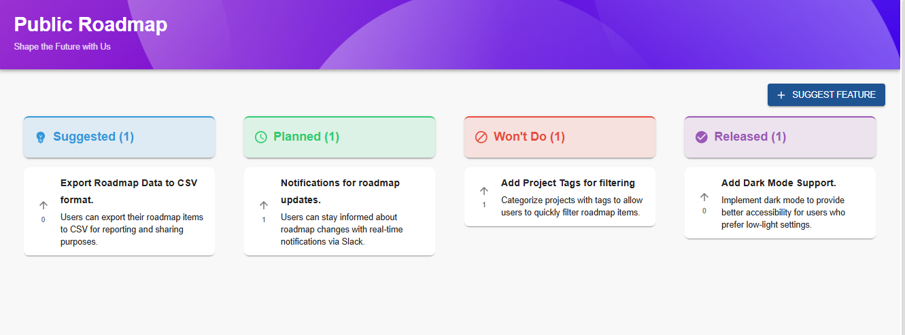
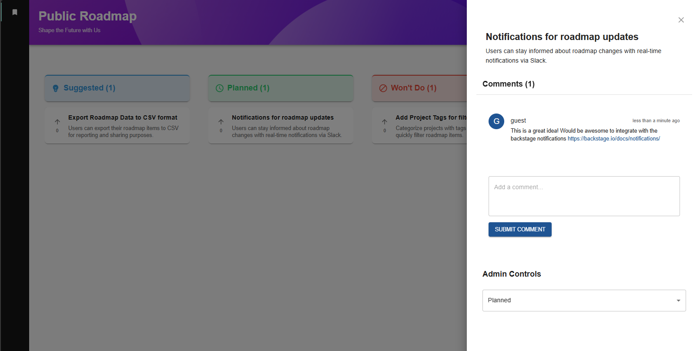
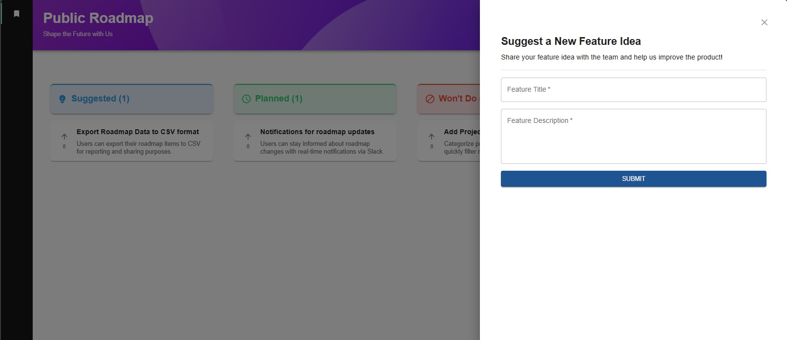

# 🗺️ Backstage Roadmap Plugin

## 🌟 Overview

The Backstage Roadmap Plugin takes roadmaps out of hidden places like Confluence and puts them front and center. Teams can share what’s coming up, while users get to chime in by suggesting features, voting on ideas, and adding comments. It’s all about creating a space where feedback flows easily, and everyone helps shape the future of the platform together.

🚀 **Note:** This plugin requires you to use the new Backstage backend system.

## 📸 Screenshots

### Main Dashboard



### Feature Details



### Suggest New Feature



## ✨ Features

- 📊 Visual roadmap board
- 🗳️ Voting system
- 💬 Comment section for each feature
- 🔐 Role-based permissions (admin vs. regular user)
- 🆕 Feature suggestion form for users

## 🛠️ Installation

🚀 **Note:** This plugin is still in active development and is not yet on NPM

1. Install the plugin in your Backstage instance:

   ```
   yarn add --cwd packages/backend @rothenbergt/backstage-plugin-roadmap-backend
   yarn add --cwd packages/app @rothenbergt/backstage-plugin-roadmap
   ```

2. Add the plugin to your `packages/backend/src/index.ts`:

   ```typescript
   import roadmap from ;
   // ...
   backend.add(import('@rothenbergt/backstage-plugin-roadmap-backend'));
   ```

3. Add the frontend plugin to your `packages/app/src/App.tsx`:
   ```typescript
   import { RoadmapPage } from '@rothenbergt/backstage-plugin-roadmap';
   // ...
   <FlatRoutes>
     {/* ... */}
     <Route path="/roadmap" element={<RoadmapPage />} />
   </FlatRoutes>;
   ```

## 🖥️ Usage

After installation, navigate to the `/roadmap` route in your Backstage instance. From there, you can:

- View the current roadmap
- Vote on features
- Suggest new features
- Comment on existing features
- (Admins) Manage feature statuses

## ⚙️ Configuration

If you aren't utilizing the Backstage permission framework, add the following to your `app-config.yaml` to enable the Admin Functions for specific users:

```yaml
roadmap:
  adminUsers:
    - user:default/admin1
    - user:default/admin2
```

## 🤝 Contributing

We welcome contributions!
